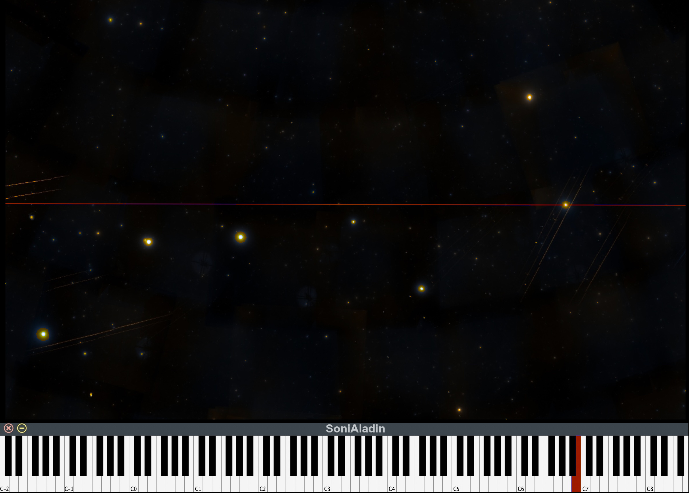

# SoniAladin
SoniAladin is an application developed in the context of the Open Science initiative of the Spanish Virtual Observatory (SVO). It allows the transformation of Aladin’s virtual sky into audible representations.

NOTE:
The voice recognition module requires the local model vosk-model-small-en-us-0.15.

	1- Download and unzip it from: https://alphacephei.com/vosk/models
	
	2- Copy the unzipped vosk-model-small-en-us-0.15 folder in the SoniAladin folder.
	
	3- Run the Jupyter notebook.

US English model for mobile Vosk applications.
Copyright 2020 Alpha Cephei Inc.
Accuracy: 10.38 (tedlium test) 9.85 (librispeech test-clean).
Speed: 0.11xRT (desktop).
Latency: 0.15s (right context).

